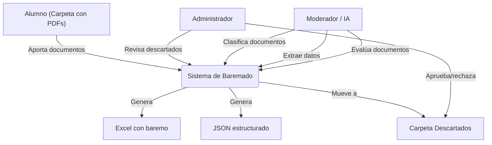
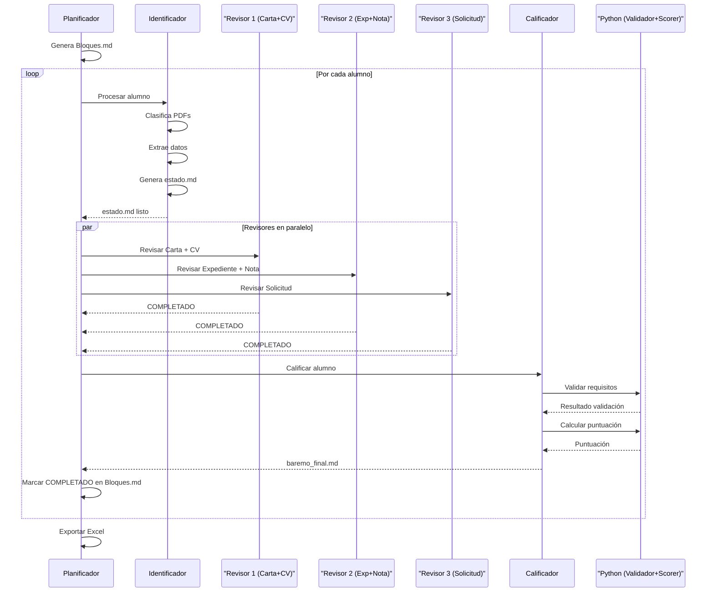

# Sistema de Baremado

Sistema multi-agente para clasificación automática de documentos académicos, extracción de datos estructurados y generación de baremos.

## Principio Clave

> **La IA NO decide admitidos/excluidos.**  
> La IA solo convierte documentos humanos en datos estructurados.  
> **Python toma las decisiones.**

## Arquitectura

```
/proyecto
├── input/                    # Carpeta con PDFs de alumnos
├── json/                     # Datos extraídos por la IA (JSON)
├── results/                  # Excel generado
├── descartados/              # Alumnos con documentación incompleta
├── temp/                     # Comunicación entre agentes (Bloques.md, estado.md)
├── skills/                   # Skills de los agentes
│   ├── planificador.md
│   ├── identificador.md
│   ├── revisor_carta_cv.md
│   ├── revisor_expediente.md
│   ├── revisor_solicitud.md
│   └── calificador.md
├── agents/
│   └── orchestrator.py       # Orquestación multi-agente
├── llm_client.py             # Cliente para LMStudio (API OpenAI-compatible)
├── classifier.py             # Clasificador de documentos por contenido
├── extractor.py              # Extractor de datos estructurados
├── pdf_utils.py              # Utilidades de lectura PDF
├── validator.py              # Validador de requisitos (PYTHON)
├── scorer.py                 # Calculador de puntuaciones (PYTHON)
├── export.py                 # Generador de Excel (PYTHON)
├── main.py                   # Orquestador principal
├── demo.py                   # Demo con datos de ejemplo
└── config.json               # Configuración del sistema
```

## Diagrama de Casos de Uso



## Diagrama de Secuencia



## Flujo del Pipeline

```
INPUT/ (PDFs)
    │
    ▼
IDENTIFICADOR (IA) ──── Clasifica documentos por contenido
    │                    Categorías: solicitud, carta_aceptación,
    │                    expediente, nota_media, CV
    ▼
EXTRACTOR (IA) ──────── Extrae datos estructurados (JSON)
    │
    ▼
VALIDATOR (Python) ──── Verifica que todos los docs requeridos existen
    │                    Si faltan → Descartado
    ▼
SCORER (Python) ─────── Aplica baremo con pesos
    │                    nota_media=40%, expediente=30%,
    │                    CV=15%, carta=10%, solicitud=5%
    ▼
EXPORT (Python) ─────── Genera Excel con ranking
```

## Agentes del Sistema

| Agente | Skill | Función |
|---|---|---|
| **Planificador** | `skills/planificador.md` | Divide alumnos en bloques de 50, orquesta el flujo |
| **Identificador** | `skills/identificador.md` | Clasifica PDFs por contenido, mapea documentos |
| **Revisor 1** | `skills/revisor_carta_cv.md` | Evalúa carta de aceptación y CV |
| **Revisor 2** | `skills/revisor_expediente.md` | Evalúa expediente académico y nota media |
| **Revisor 3** | `skills/revisor_solicitud.md` | Evalúa solicitudes de admisión |
| **Calificador** | `skills/calificador.md` | Consolida puntuaciones y genera baremo |

## Decisiones Python vs IA

| Decisión | Responsable |
|---|---|
| Clasificar tipo de documento | IA |
| Extraer datos (nombre, notas, etc.) | IA |
| Evaluar calidad del documento (0-10) | IA |
| ¿Faltan documentos requeridos? | **Python** |
| ¿La confianza es suficiente? | **Python** |
| Cálculo de puntuación final | **Python** |
| Ranking y ordenación | **Python** |
| Generación de Excel | **Python** |
| Decisión final (admitido/excluido) | **Python** |

## Instalación

```bash
# Clonar
git clone https://github.com/martinhnandezfnandez-code/sistema-de-baremado.git
cd sistema-de-baremado

# Instalar dependencias
pip install openai pypdf2 pdfminer.six openpyxl pydantic reportlab
```

## Configurar LMStudio

1. Descargar e instalar [LMStudio](https://lmstudio.ai/)
2. Descargar un modelo open-source (ej: Qwen 2.5 7B Instruct)
3. Iniciar el servidor API: `http://localhost:1234/v1`
4. Ajustar `config.json` si es necesario

## Uso

```bash
# Demo con datos simulados (sin LMStudio)
python demo.py --mock

# Pipeline completo (con LMStudio corriendo)
python demo.py

# Modo agente (orquestación multi-agente)
python main.py --mode agent

# Modo pipeline directo
python main.py --mode pipeline
```
(Tú solo ejecutas python main.py --mode agent y el orquestador hace todo. 
Si quieres pararte entre pasos a inspeccionar, puedes ejecutar el pipeline paso a paso con python main.py --mode pipeline y ver los JSON/estado.md intermedios.)
## Estructura de Entrada

```
input/
├── alumno_001/
│   ├── carta_aceptacion.pdf
│   ├── expediente_academico.pdf
│   ├── nota_media.pdf
│   ├── cv.pdf
│   └── solicitud.pdf
└── alumno_002/
    └── ...
```

Los nombres de archivo **no son fiables** — el sistema clasifica por **contenido**, no por nombre.

## Documentos Requeridos

| Documento | Obligatorio |
|---|---|
| Carta de aceptación | ✅ |
| Expediente académico | ✅ |
| Nota media | ✅ |
| CV | ✅ |
| Solicitud (1 o más) | ✅ |

Si falta alguno → el alumno pasa a `descartados/` con indicación del motivo.

## Salida

- `results/baremo_resultados.xlsx` — Excel con 3 hojas:
  - **Admitidos**: ranking ordenado por puntuación
  - **Descartados**: alumnos excluidos con motivo
  - **Resumen**: métricas globales
- `json/{alumno}.json` — datos extraídos por alumno
- `temp/{alumno}_estado.md` — estado detallado por alumno
- `temp/{alumno}_baremo.md` — baremo final por alumno
