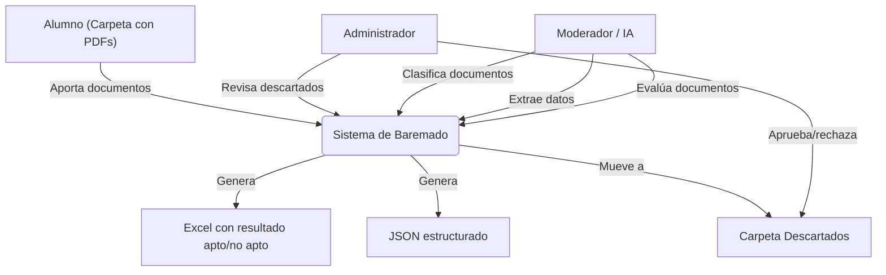
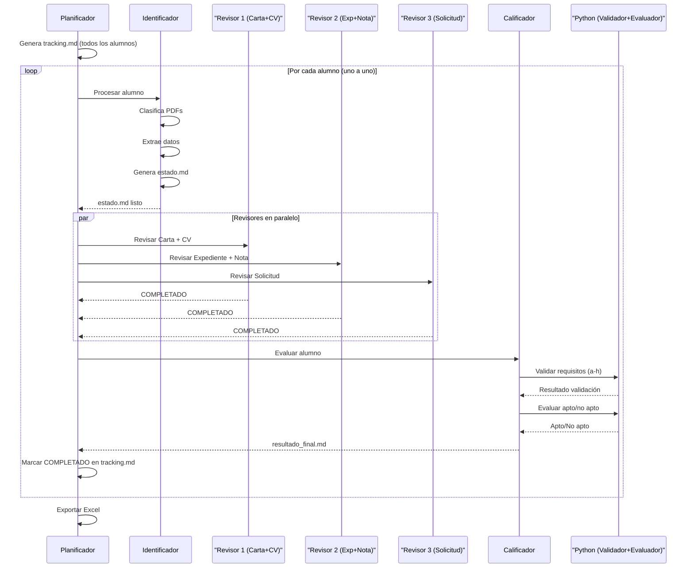

### Ejercicio de entornos para el Ces Lope de Vega Sobre diseño de un sistema de baremacion

# Sistema de Baremado

Sistema multi-agente para clasificación automática de documentos académicos, extracción de datos estructurados y verificación de requisitos de elegibilidad para prácticas académicas externas de la Universidad de Córdoba.

> **Soporte OCR**: los PDFs escaneados (imágenes) se procesan automáticamente mediante Tesseract OCR cuando la extracción de texto directa no obtiene resultados.

## Principio Clave

> **La IA NO decide aptos/no aptos.**  
> La IA solo convierte documentos humanos en datos estructurados.  
> **Python toma las decisiones.**

## Arquitectura

```
/proyecto
├── input/                    # Carpeta con PDFs de alumnos
├── json/                     # Datos extraídos por la IA (JSON)
├── results/                  # Excel generado
├── descartados/              # Alumnos con documentación incompleta
├── temp/                     # Comunicación entre agentes (tracking.md, estado.md)
├── skills/                   # Skills de los agentes
│   ├── planificador.md
│   ├── identificador.md
│   ├── revisor_carta_cv.md
│   ├── revisor_expediente.md
│   ├── revisor_solicitud.md
│   └── calificador.md
├── agents/
│   └── orchestrator.py       # Orquestación multi-agente
├── llm_client.py             # Cliente para Ollama (API OpenAI-compatible)
├── classifier.py             # Clasificador de documentos por contenido
├── extractor.py              # Extractor de datos estructurados
├── pdf_utils.py              # Utilidades de lectura PDF
├── validator.py              # Validador de requisitos de elegibilidad (PYTHON)
├── scorer.py                 # Evaluador binario: Apto/No apto (PYTHON)
├── export.py                 # Generador de Excel (PYTHON)
├── main.py                   # Orquestador principal
├── demo.py                   # Demo con datos de ejemplo
└── config.json               # Configuración del sistema
```

## Diagrama de Casos de Uso



## Diagrama de Secuencia



## Flujo del Pipeline

```
INPUT/ (PDFs — texto o escaneados)
    │
    ▼
PDF UTILS (Python) ──── Extrae texto del PDF
    │                    • pdfminer / PyPDF2 (texto directo)
    │                    • Tesseract OCR (fallback si es escaneado)
    ▼
IDENTIFICADOR (IA) ──── Clasifica documentos por contenido
    │                    Categorías: solicitud, carta_aceptación,
    │                    expediente, nota_media, CV
    ▼
EXTRACTOR (IA) ──────── Extrae datos estructurados (JSON)
    │
    ▼
VALIDATOR (Python) ──── Verifica los 8 requisitos de elegibilidad (a-h)
    │                    • a) Matriculado en UCO o centros adscritos
    │                    • b) Matrícula en vigor y expediente abierto
    │                    • c) 50% créditos superados (Grado)
    │                    • d) Certificado delitos sexuales (si aplica)
    │                    • e) Duración prácticas misma entidad ≤ máxima
    │                    • f) Duración total prácticas ≤ máxima
    │                    • g) Movilidad sin incompatibilidad
    │                    • h) Bolsa actual sin renuncia obligada
    ▼
EVALUADOR (Python) ──── Determina Apto/No apto
    │                    • Apto = cumple TODOS los requisitos
    │                    • No apto = no cumple alguno
    ▼
EXPORT (Python) ─────── Genera Excel con checklist de requisitos
```

## Agentes del Sistema

| Agente | Skill | Función |
|---|---|---|
| **Planificador** | `skills/planificador.md` | Genera tracking.md, orquesta el flujo alumno por alumno |
| **Identificador** | `skills/identificador.md` | Clasifica PDFs por contenido, mapea documentos |
| **Revisor 1** | `skills/revisor_carta_cv.md` | Evalúa carta de aceptación y CV |
| **Revisor 2** | `skills/revisor_expediente.md` | Evalúa expediente académico y nota media |
| **Revisor 3** | `skills/revisor_solicitud.md` | Evalúa solicitudes de admisión |
| **Calificador** | `skills/calificador.md` | Consolida datos y determina Apto/No apto |

## Decisiones Python vs IA

| Decisión | Responsable |
|---|---|
| Clasificar tipo de documento | IA |
| Extraer datos (nombre, notas, etc.) | IA |
| Extraer texto de PDFs (con OCR si es escaneado) | **Python** |
| Extraer datos estructurados (nombre, universidad, créditos...) | IA |
| Clasificar tipo de documento por contenido | IA |
| ¿Faltan documentos requeridos? | **Python** |
| ¿La confianza es suficiente? | **Python** |
| **Verificar requisitos de elegibilidad (a-h)** | **Python** |
| **Decisión final (apto/no apto)** | **Python** |
| Generación de Excel | **Python** |

## Instalación

```bash
# Clonar
git clone https://github.com/martinhnandezfnandez-code/sistema-de-baremado.git
cd sistema-de-baremado

# Instalar dependencias Python
pip install -r requirements.txt
```

### Dependencias del sistema (OBLIGATORIAS)

Tesseract OCR y Poppler son **requisitos obligatorios**. El programa los necesita aunque los PDFs tengan texto incrustado, porque cualquier PDF puede contener páginas mixtas (texto + imágenes escaneadas). Sin ellos, el programa **no podrá procesar** los documentos y descartará a los alumnos como "Sin PDFs legibles".

**[Tesseract OCR](https://github.com/tesseract-ocr/tesseract)** — Motor de OCR
- **Windows**: Descargar installer desde [UB-Mannheim](https://github.com/UB-Mannheim/tesseract/wiki). Marcar idioma Spanish durante la instalación.
- **Linux**: `sudo apt install tesseract-ocr tesseract-ocr-spa`
- **macOS**: `brew install tesseract`

**[Poppler](https://poppler.freedesktop.org/)** — Conversor de PDF a imágenes
- **Windows**: Descargar desde [poppler-windows](https://github.com/oschwartz10612/poppler-windows/releases/), extraer y añadir `Library\bin\` al PATH del sistema.
- **Linux**: `sudo apt install poppler-utils`
- **macOS**: `brew install poppler`

> Si usas este proyecto desde una máquina limpia, instala Tesseract y Poppler **antes** de ejecutar el programa.

## Configurar Ollama

1. Instalar [Ollama](https://ollama.ai/)
2. Descargar un modelo: `ollama pull qwen3:4b` (o cualquier modelo compatible con OpenAI API)
3. Ollama sirve automáticamente en `http://localhost:11434/v1` con API compatible con OpenAI
4. Ajustar `config.json` si es necesario (modelo, temperatura, etc.)

## Requisitos de Elegibilidad (a-h)

El sistema verifica 8 requisitos basados en el Reglamento de Prácticas Académicas Externas de la Universidad de Córdoba:

| Clave | Requisito | ¿Qué comprueba? |
|---|---|---|
| **a** | Matriculado en UCO | El estudiante pertenece a la Universidad de Córdoba o centros adscritos |
| **b** | Matrícula en vigor | Tiene matrícula activa y expediente académico abierto |
| **c** | 50% créditos (Grado) | Ha superado al menos la mitad de los créditos de su titulación (solo Grado) |
| **d** | Certificado delitos | Si la práctica implica menores/discapacidad, debe tener certificado negativo |
| **e** | Prácticas misma entidad | No ha superado la duración máxima en una misma entidad |
| **f** | Prácticas total máximo | No ha superado la duración máxima total de prácticas |
| **g** | Movilidad | Estudiantes de movilidad pueden participar si no hay incompatibilidad |
| **h** | Bolsa/ayuda | No aceptar nueva práctica si implica renunciar a bolsa actual (salvo causa justificada) |

**Resultado**: Apto (cumple todos) o No apto (incumple alguno). Sistema binario, sin puntuación numérica.

### ✅ Cómo cambiar los requisitos (guía paso a paso)

Todo se configura en `config.json` → `requisitos`. Cada entrada tiene:

- `activo`: `true`/`false` para activar/desactivar el requisito
- `descripcion`: Texto descriptivo
- Campos de configuración específicos de cada requisito

**Ejemplo: cambiar universidades válidas:**
```json
"a_matriculado_uco": {
  "activo": true,
  "valores_validos": ["universidad de córdoba", "uco", "córdoba", "cordoba"]
}
```

**Ejemplo: cambiar el % mínimo de créditos:**
```json
"c_creditos_50": {
  "activo": true,
  "min_ratio": 0.5,
  "excepcion_titulaciones": ["master", "máster", "doctorado"]
}
```

**Ejemplo: cambiar duración máxima de prácticas:**
```json
"e_practicas_misma_entidad": {
  "activo": true,
  "max_duracion_meses": 12
}
"f_practicas_maximo_total": {
  "activo": true,
  "max_duracion_meses": 24
}
```

> **Regla general**: la IA extrae los campos del documento, Python evalúa cada condición configurable. Si activas un requisito, el alumno debe cumplirlo para ser Apto.

## Uso

```bash
# Demo con datos simulados (sin Ollama)
python demo.py --mock

# Pipeline completo (con Ollama corriendo)
python demo.py

# Modo agente (orquestación multi-agente)
python main.py --mode agent

# Modo pipeline directo
python main.py --mode pipeline
```
(Tú solo ejecutas python main.py --mode agent y el orquestador hace todo. 
Si quieres pararte entre pasos a inspeccionar, puedes ejecutar el pipeline paso a paso con python main.py --mode pipeline y ver los JSON/estado.md intermedios.)
## Estructura de Entrada

```
input/
├── alumno_001/
│   ├── carta_aceptacion.pdf
│   ├── expediente_academico.pdf
│   ├── nota_media.pdf
│   ├── cv.pdf
│   └── solicitud.pdf
└── alumno_002/
    └── ...
```

Los nombres de archivo **no son fiables** — el sistema clasifica por **contenido**, no por nombre.

## Documentos Requeridos

| Documento | Obligatorio |
|---|---|
| Carta de aceptación | ✅ |
| Expediente académico | ✅ |
| Nota media | ✅ |
| CV | ✅ |
| Solicitud (1 o más) | ✅ |

Si falta alguno → el alumno pasa a `descartados/` con indicación del motivo.

## Salida

- `results/baremo_resultados.xlsx` — Excel con 3 hojas:
  - **Aptos**: alumnos que cumplen todos los requisitos con checklist
  - **No aptos**: alumnos que no cumplen con detalle de requisitos fallados
  - **Resumen**: desglose por requisito y métricas globales
- `json/{alumno}.json` — datos extraídos por alumno
- `temp/{alumno}_estado.md` — estado detallado por alumno
- `temp/{alumno}_baremo.md` — resultado final por alumno
